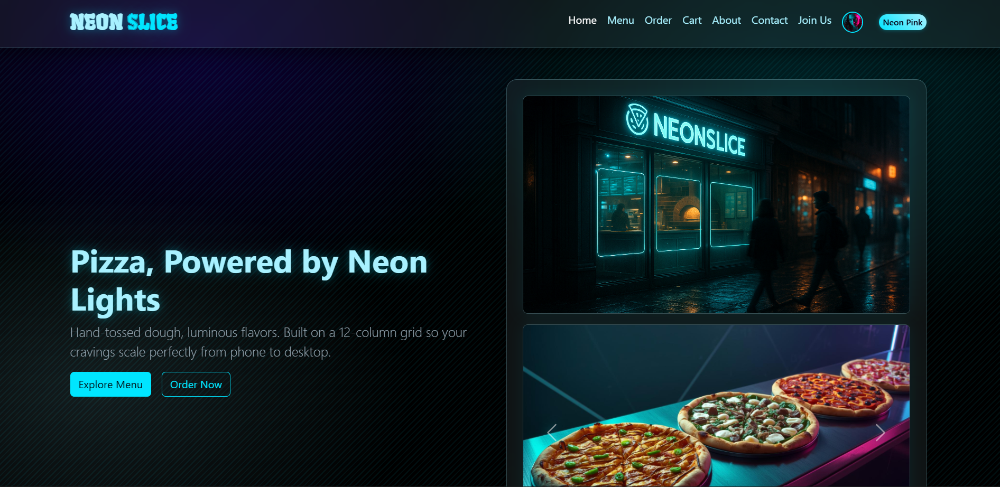
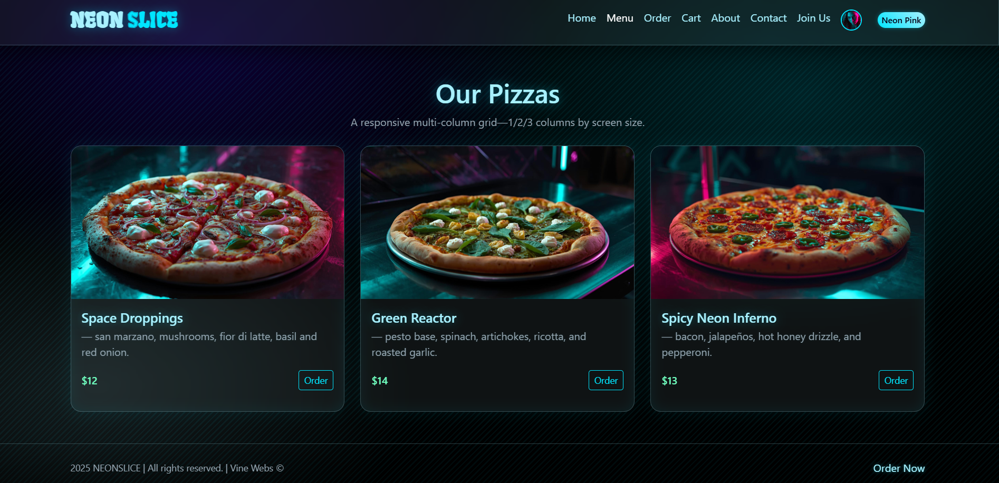
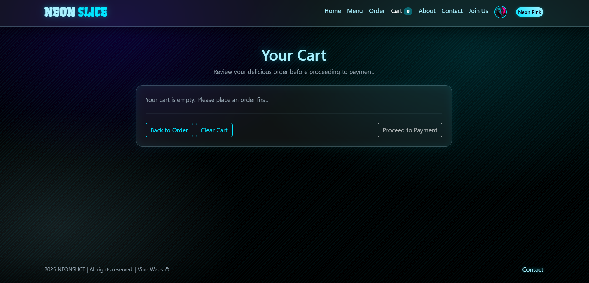
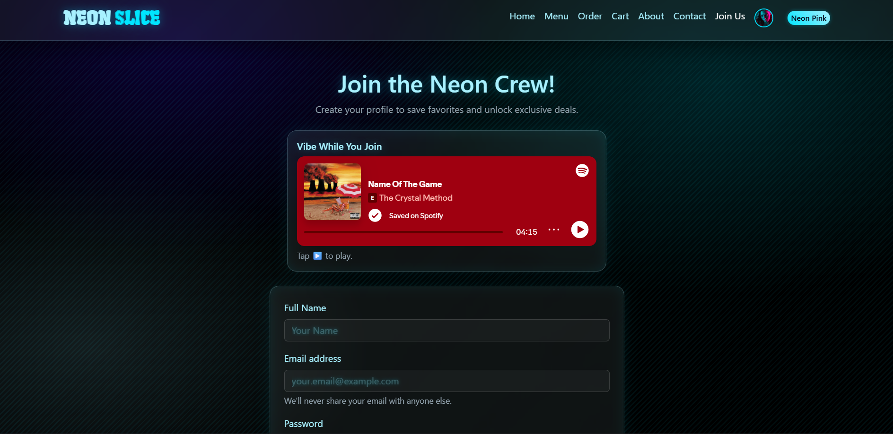
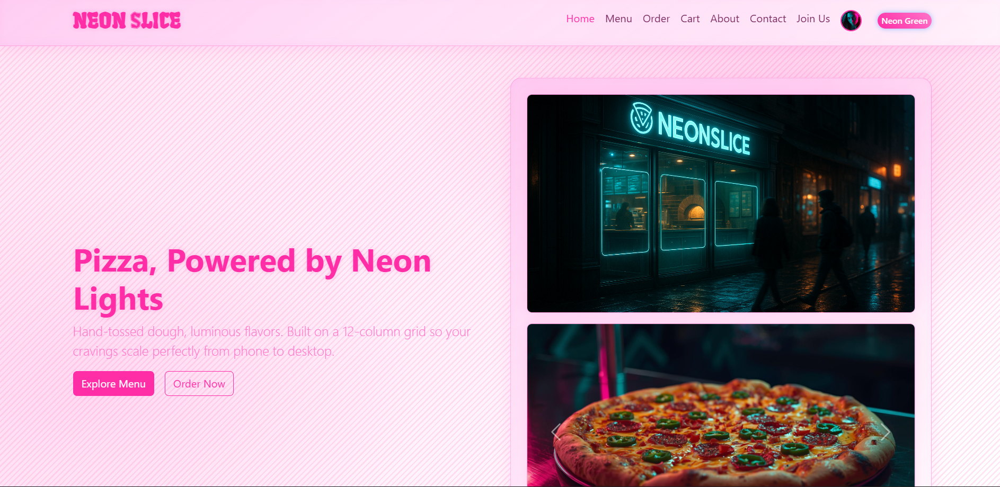

# NEON SLICE — Cyberpunk Pizzeria

\*_Author: Chris Vine_
https://www.linkedin.com/in/christopher-vine/

## Overview

A multi-page pizza website with a neon/glassmorphism aesthetic using **HTML**, **CSS**, and **Bootstrap 5.3.8**. Includes a responsive menu grid, hero carousel, and an accessible order form.

## Live Demo

https://project-1-vt4r.onrender.com

## Features

- Responsive 12-column Bootstrap grid

## Technologies

HTML5 • CSS3 • Bootstrap 5.3.8

## Future Improvements

1. Add functional profile upon join us completion. Login/sign up location rather. 
2. Add open operation hours for the establishment

## WireFrame

1. **built with draw.io**
2. 

3. 
4. 

## Snapshots

## Snapshots

  
  
  
  
  
  

## User Story

**As a hungry customer,*
**I want to browse a vibrant cyberpunk-themed pizzeria menu, customize my order, and complete a secure checkout,*
**so that I can enjoy a fast, futuristic, and visually immersive ordering experience that saves my preferences for next time.*
